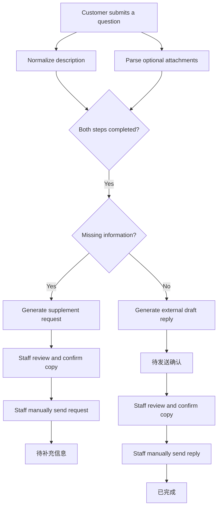

[English](README.md) | [简体中文](README.zh-CN.md)

# Ticket Copilot

**Turn vague customer questions into human-reviewed, copy-ready support replies.**

Ticket Copilot is an open workflow template for support teams. It normalizes customer questions, parses optional attachments, identifies missing information, drafts reply suggestions, and records the final human-confirmed version.

It is intentionally human-in-the-loop: AI prepares the draft, but support staff always review, copy, and send the final message manually.

## Why Ticket Copilot?

Support teams repeatedly spend time clarifying incomplete questions and rewriting similar answers. Ticket Copilot provides a reusable MVP for:

- Standardizing vague customer questions without inventing facts
- Requesting the right missing information
- Producing copy-ready draft replies for human review
- Separating internal decision basis from customer-facing text
- Preserving the final confirmed reply for future reuse

## Core Principles

1. AI draft replies are never sent automatically.
2. Every reply must be reviewed by support staff.
3. “Confirm copy” only copies and records the approved reply.
4. Support staff manually paste and send messages through their existing tools.
5. Customer-facing replies never include model reasoning.
6. Rules take priority over AI-generated text.

## Workflow



## Fixed States

```text
待分析 / 待补充信息 / 待发送确认 / 已完成
```

## Fixed Attachment States

```text
无附件 / 解析成功 / 格式不支持 / 解析失败
```

## Quick Start

1. Read the [project overview](docs/01-project-overview.md) and [workflow](docs/02-workflow.md).
2. Create the minimum fields defined in the [field specification](docs/04-field-spec.md).
3. Configure your workflow using the [trigger matrix](docs/05-trigger-matrix.md).
4. Adapt the public [prompt structures](docs/06-prompt-structure.md) to your model provider.
5. Validate your setup with the [sanitized demo cases](docs/09-demo-cases.md).
6. Use the reusable [Agent Skill](skill/SKILL.md) when asking an AI coding agent to design or review the workflow.

## Included Examples

| Example | Purpose |
|---|---|
| [Sufficient information](examples/cases/case-202605310014.md) | Generate a formal draft reply |
| [Missing information](examples/cases/case-202605310015.md) | Generate a supplement request |
| [Feature availability limitation](examples/cases/case-202605310013.md) | Avoid unverified capability claims |
| [Knowledge base minimum set](examples/kb/kb-minimum-10.json) | 10 sanitized knowledge entries |
| [Phrasebook minimum set](examples/phrasebook/phrasebook-minimum-6.json) | 6 reusable customer-facing phrases |
| [No-hit acceptance cases](examples/validation/no-kb-hit-acceptance-3.json) | 3 tests for unknown requests |

## Repository Layout

```text
docs/       Workflow documentation and public specifications
examples/   Sanitized cases, knowledge entries, and acceptance examples
skill/      Reusable Agent Skill, public prompt structures, and JSON Schemas
```

## Safety Boundary

This public repository does **not** include:

- Automatic message sending
- Internal automation IDs or field IDs
- Accounts, tokens, keys, or private network addresses
- Real customer data or attachments
- Proprietary internal prompts

Read the full [release boundary](docs/10-release-boundary.md).

## Roadmap

### v1.0.0: MVP

- Description normalization
- Attachment parsing state model
- Missing-information gate
- Copy-ready draft replies
- Mandatory human review and confirm-copy workflow

### v1.1.0: Knowledge Base Enhancement

- Internal knowledge base integration
- Standard phrasebook integration
- Knowledge match records
- Tutorial references
- Confirmed-answer retention rules

## License

[MIT](LICENSE)
